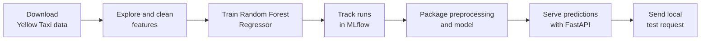

# Model Deployment Project

Please **use this repository as a template** for your model deployment project. Create pull requests in your own repository even if you are working alone, and use them to track the work you complete.

This repository is a local-first template for an MLE deployment project. The goal is to train a regression model, track experiments with MLflow, expose predictions through an API, and verify the full workflow on your own machine.

## Project Hub

- [README.md](./README.md): Repository overview, setup and workflow.
- [project-description.md](./project-description.md): Assignment brief, deliverables and stretch goals.
- [requirements.txt](./requirements.txt): Pinned Python dependencies for the local environment.

## Learning Path

1. Read the assignment brief in [project-description.md](./project-description.md).
2. Download and inspect the January 2025 Yellow Taxi dataset.
3. Train a baseline `RandomForestRegressor` and track runs locally with MLflow.
4. Refactor preprocessing and training logic into reusable Python modules.
5. Build a local prediction API with FastAPI.
6. Send a test request to the API and document the outcome in your README or PR.



## Mermaid Diagrams

This repository contains Mermaid diagrams. If you want them to render in VS Code, we recommend installing the `Markdown Preview Mermaid Support` extension:

- [Install in VS Code](vscode:extension/bierner.markdown-mermaid)
- [View on Marketplace](https://marketplace.visualstudio.com/items?itemName=bierner.markdown-mermaid)

## Environment

Please set up a new virtual environment. You can use the following commands:

### `macOS` / `Linux`

```bash
pyenv local 3.11.3
python3 -m venv .venv
source .venv/bin/activate
python -m pip install --upgrade pip
python -m pip install -r requirements.txt
```

### `Windows`

For `Git Bash` CLI:

```bash
pyenv local 3.11.3
python -m venv .venv
source .venv/Scripts/activate
python -m pip install --upgrade pip
python -m pip install -r requirements.txt
```

For `PowerShell` CLI:

```powershell
pyenv local 3.11.3
python -m venv .venv
.venv\Scripts\Activate.ps1
python -m pip install --upgrade pip
python -m pip install -r requirements.txt
```

## Working Locally

Once you have implemented the project code, a typical local workflow looks like this:

1. Train the model and log runs to the local `mlruns/` directory with MLflow.
2. Start the tracking UI with `mlflow ui --backend-store-uri ./mlruns --port 5000`.
3. Run the API locally with `uvicorn app.main:app --reload --port 8000`.
4. Send a request such as `curl -X POST http://127.0.0.1:8000/predict -H "Content-Type: application/json" -d @sample-request.json`.

## Learning Objectives

- Build an end-to-end regression workflow for real-world taxi trip data.
- Separate exploration, preprocessing, training, and serving concerns into maintainable code.
- Track experiments locally with MLflow and compare model runs.
- Serve model predictions through a local API.
- Communicate results clearly through pull requests and README documentation.
